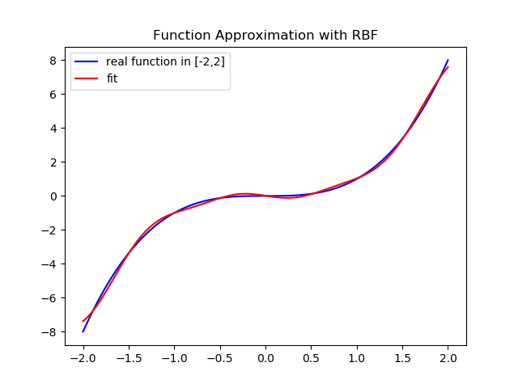

# RBF-Function-Approximation
Approximation of a function with RBF Network ,Homework for Computation Intelligence course @ IUST


# Example
in this example which is implemented in `main.py` we try to approximate y=x^3 function.
we used `RBF` class implemented in `RBF.py` with 8 radial basis function for learning the function in [-2,2]

if you want to run this example with your own parameters, run command below:
```
python main.py [-h] [-n FUNCTIONS] [-s SIGMA] [-o SAVE]
```

+ -h : help for running this example
+ -n : number of radial basis functions
+ -s : sigma for radial basis functions
+ -o : boolean for saving the result of approximation

# Dependencies
for running this code you should have these dependencies:
+ Python 3.5 or above
+ numpy
+ matplotlib


# Result
result for approximating x^3 with 8 radial basis functions is plotted below:


